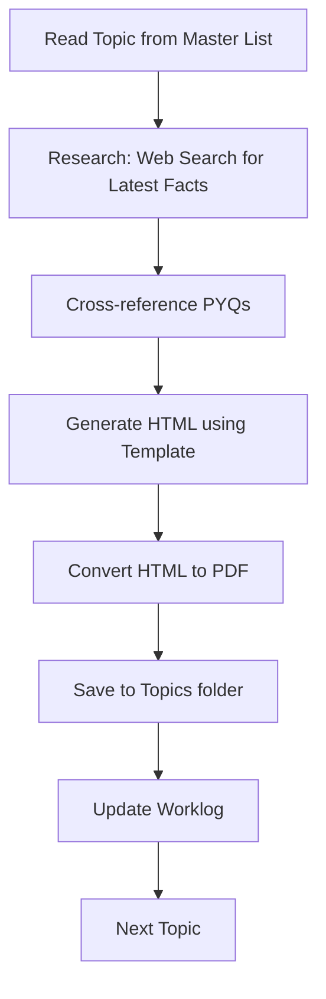

# BPSC 72nd Prelims — Topic-wise PDF Generation System

## Background & Research Findings

### Exam Overview
- **Exam Date:** July 26, 2026 (**10 days away**)
- **Format:** 150 MCQs, 2 hours, **-1/3 negative marking** (must mark "E" to skip safely)
- **Vacancies:** 1,186 posts
- **Purpose:** Screening test — marks not counted in final merit

### Topic-Wise Question Distribution (PYQ Trend Analysis)

| Subject | 69th | 70th | 71st | Avg | Approx % |
|:---|:---:|:---:|:---:|:---:|:---:|
| **Current Affairs** | 30 | 35 | 29 | 31 | ~21% |
| **History** | 29 | 29 | 26 | 28 | ~19% |
| **General Science** | 22 | 25 | 29 | 25 | ~17% |
| **Geography** | 18 | 20 | 20 | 19 | ~13% |
| **Bihar Special** | 15 | 14 | 18 | 16 | ~11% |
| **Polity** | 13 | 12 | 15 | 13 | ~9% |
| **Quant/Reasoning** | 10 | 10 | 9 | 10 | ~7% |
| **Economy** | 13 | 5 | 4 | 7 | ~5% |

### Key Strategy Insights
1. **Current Affairs + History + Science = ~57% of paper** — these three areas alone can determine your cut-off
2. **Bihar angle is woven into ALL subjects** — every topic should have a Bihar connection section
3. **PYQ repetition is common** — BPSC frequently repeats themes and even exact questions
4. **Accuracy > Speed** due to 1/3rd negative marking

---

## Proposed Content Rules (Document Template)

Each PDF will follow this **standardized structure** to ensure consistency:

### Document Template — 7 Sections

```
📄 [Serial#]_[Topic_Name].html → converted to PDF

SECTION 1: TOPIC HEADER
  - Topic name, Category, Tier/Weight, Serial number
  - Exam relevance score (based on PYQ frequency)

SECTION 2: CORE CONTENT (The "What to Know")
  - Concept breakdown in bullet-point format
  - Key facts, dates, names, data points
  - Tables for comparative/list-heavy topics
  - Mnemonics or memory aids where applicable

SECTION 3: FACT MATRIX (Quick-Reference Tables)
  - High-density factual tables
  - Comparison charts (e.g., Moderates vs Extremists)
  - Timeline strips for chronological topics

SECTION 4: BIHAR CONNECTION 🔗
  - How this topic connects to Bihar specifically
  - Bihar-specific facts, data, personalities
  - (MANDATORY for every topic — even Science/Math get Bihar context)

SECTION 5: CROSS-TOPIC CONNECTIONS
  - Links to related topics in the syllabus
  - How this topic connects to Current Affairs
  - Interdisciplinary facts (e.g., Economy ↔ Geography)

SECTION 6: CURRENT RELEVANCE (2024-2026)
  - Recent developments related to this topic
  - News items, new policies, updated data
  - Potential "twist" areas for questions

SECTION 7: MCQ PRACTICE SET (15-20 Questions)
  - Mix of: PYQ-inspired (40%), Probable (40%), Tricky (20%)
  - 4 options per question (A/B/C/D)
  - Answer key with brief explanations at the end
  - Difficulty: BPSC Prelims level
```

### Content Quality Rules

| Rule | Description |
|:---|:---|
| **R1: Bihar-First** | Every topic MUST have a Bihar connection, no matter how remote |
| **R2: Fact-Dense** | Prioritize memorizable facts over lengthy explanations |
| **R3: Table-Heavy** | Use tables for any list with ≥3 items |
| **R4: PYQ-Anchored** | Reference PYQ patterns wherever possible |
| **R5: Current** | Include 2024-2026 updates for every applicable topic |
| **R6: MCQ Quality** | Questions must be BPSC-style: factual, direct, sometimes tricky options |
| **R7: Mnemonics** | Include memory tricks for hard-to-remember lists |
| **R8: Cross-Link** | Reference other topic numbers for quick cross-study |
| **R9: Visual Structure** | Use icons, boxes, bold/italic consistently |
| **R10: Concise** | Each document should be 8-15 pages when printed |
| **R11: Interactive MCQ** | 20-30 radio-button questions; "Check Answers" JS button; green/red highlight |
| **R12: Reference Links** | 5-10 curated external references at the end of each topic |
| **R13: Web Images** | Embed multiple relevant images (maps, portraits, diagrams) locally |
| **R14: Flowcharts** | Use CSS/SVG diagrams for processes, hierarchies, timelines |
| **R15: Quality Check** | Apply pre-generation checklist covering key dimensions before completion |
| **R16: Linked Subpages** | Keep main page concise; move detailed facts into local hyperlinked subpages |
| **R17: Detailed Content** | Subpages must contain core concepts, static details (STATICS), background/history, and current relevance |
| **R18: Memory Images** | Embed representational images in both main pages and subpages for better retention |
| **R19: Master Landing Page** | Central landing page (index.html) listing all 158 topics in well-organized sections |

---

## Priority-Sorted Topic Execution Order

Topics are sorted by: **Tier (A→B→C) → Weight (descending) → Category grouping**

### Phase 1: TIER A — Highest Priority (96 topics)

#### Block 1: Current Affairs (Wt 1.7 each) — Topics 1-14
| # | File Name | Topic |
|:--|:--|:--|
| 1 | `1_govt_schemes_and_policies` | Govt schemes and policies |
| 2 | `2_national_appointments` | National appointments |
| 3 | `3_intl_appointments_and_orgs` | Intl appointments and orgs |
| 4 | `4_summits_and_groupings` | Summits and groupings |
| 5 | `5_bilateral_relations` | Bilateral relations |
| 6 | `6_defence_and_security` | Defence and security |
| 7 | `7_economy_in_news` | Economy in news |
| 8 | `8_science_and_tech_in_news` | Science and tech in news |
| 9 | `9_awards_and_honours` | Awards and honours |
| 10 | `10_sports` | Sports |
| 11 | `11_reports_and_indices` | Reports and indices |
| 12 | `12_important_days_and_themes` | Important days and themes |
| 13 | `13_books_authors_obituaries` | Books and authors / obituaries |
| 14 | `14_environment_in_news` | Environment in news |

#### Block 2: Bihar Current Affairs (Wt 1.3 each) — Topics 15-23
| # | File Name | Topic |
|:--|:--|:--|
| 15 | `15_bihar_govt_schemes` | Bihar govt schemes/yojanas |
| 16 | `16_bihar_state_budget` | State budget highlights |
| 17 | `17_bihar_appointments` | Appointments in Bihar |
| 18 | `18_bihar_awards` | Bihar awards and honours |
| 19 | `19_bihar_sports` | Bihar sports |
| 20 | `20_bihar_infra_projects` | Infra and projects |
| 21 | `21_bihar_surveys_data` | Surveys and data |
| 22 | `22_bihar_festivals_culture` | Festivals and culture in news |
| 23 | `23_bihar_national_reports` | Bihar in national reports |

#### Block 3: Maths & Mental Ability (Wt 1.0 each) — Topics 24-33
| # | File Name | Topic |
|:--|:--|:--|
| 24 | `24_number_system` | Number system and simplification |
| 25 | `25_percentage` | Percentage |
| 26 | `26_ratio_proportion` | Ratio and proportion |
| 27 | `27_average` | Average |
| 28 | `28_profit_loss` | Profit and loss |
| 29 | `29_si_ci` | SI and CI |
| 30 | `30_time_and_work` | Time and work |
| 31 | `31_speed_time_distance` | Speed, time and distance |
| 32 | `32_number_letter_series` | Number/letter series |
| 33 | `33_reasoning` | Reasoning |

#### Block 4: Static GK (Wt 1.0 each) — Topics 34-42
| # | File Name | Topic |
|:--|:--|:--|
| 34 | `34_awards_static` | Awards (static) |
| 35 | `35_books_authors_classic` | Books and authors (classic) |
| 36 | `36_sports_static` | Sports static |
| 37 | `37_first_india_world` | First in India/World |
| 38 | `38_superlatives` | Superlatives |
| 39 | `39_national_symbols` | National symbols |
| 40 | `40_organisations_hq` | Organisations and HQ |
| 41 | `41_dances_festivals_gi` | Dances/festivals/GI |
| 42 | `42_abbreviations_days` | Abbreviations and days |

#### Block 5: Biology (Wt 1.0 each) — Topics 43-51
| # | File Name | Topic |
|:--|:--|:--|
| 43 | `43_cell_and_division` | Cell and division |
| 44 | `44_human_body_systems` | Human body systems |
| 45 | `45_nutrition_vitamins` | Nutrition and vitamins |
| 46 | `46_diseases_pathogens` | Diseases and pathogens |
| 47 | `47_blood_immunity_vaccines` | Blood, immunity, vaccines |
| 48 | `48_genetics_basics` | Genetics basics |
| 49 | `49_plant_physiology` | Plant physiology |
| 50 | `50_classification` | Classification |
| 51 | `51_biotech_ecology` | Biotech and ecology basics |

#### Block 6: Modern Indian History (Wt 0.9 each) — Topics 52-65
| # | File Name | Topic |
|:--|:--|:--|
| 52 | `52_advent_of_europeans` | Advent of Europeans |
| 53 | `53_plassey_and_buxar` | Plassey and Buxar |
| 54 | `54_economic_impact` | Economic impact |
| 55 | `55_revolt_of_1857` | Revolt of 1857 |
| 56 | `56_socio_religious_reforms` | Socio-religious reforms |
| 57 | `57_inc_formation` | INC formation |
| 58 | `58_bengal_partition_swadeshi` | Bengal Partition and Swadeshi |
| 59 | `59_home_rule_lucknow_pact` | Home Rule and Lucknow Pact |
| 60 | `60_gandhian_movements` | Gandhian movements |
| 61 | `61_civil_disobedience` | Civil Disobedience |
| 62 | `62_quit_india_1942` | Quit India 1942 |
| 63 | `63_revolutionaries` | Revolutionaries |
| 64 | `64_constitutional_acts` | Constitutional Acts |
| 65 | `65_independence_partition` | Independence and Partition |

#### Block 7: Indian Polity (Wt 0.9 each) — Topics 66-77
| # | File Name | Topic |
|:--|:--|:--|
| 66 | `66_making_of_constitution` | Making of Constitution |
| 67 | `67_preamble` | Preamble |
| 68 | `68_fundamental_rights` | Fundamental Rights |
| 69 | `69_dpsp_fundamental_duties` | DPSP and Fundamental Duties |
| 70 | `70_union_executive` | Union Executive |
| 71 | `71_parliament` | Parliament |
| 72 | `72_judiciary` | Judiciary |
| 73 | `73_federalism` | Federalism |
| 74 | `74_emergency_provisions` | Emergency provisions |
| 75 | `75_constitutional_bodies` | Constitutional bodies |
| 76 | `76_local_government` | Local government |
| 77 | `77_amendments_elections` | Amendments and elections |

#### Block 8: Bihar Geography (Wt 0.9 each) — Topics 78-86
| # | File Name | Topic |
|:--|:--|:--|
| 78 | `78_bihar_location_physical` | Location and physical divisions |
| 79 | `79_bihar_rivers_drainage` | Rivers and drainage |
| 80 | `80_bihar_climate_rainfall` | Climate and rainfall |
| 81 | `81_bihar_soils` | Soils |
| 82 | `82_bihar_agriculture_crops` | Agriculture and crops |
| 83 | `83_bihar_minerals_resources` | Minerals and resources |
| 84 | `84_bihar_forests_wildlife` | Forests and wildlife |
| 85 | `85_bihar_industries` | Industries |
| 86 | `86_bihar_districts_demography` | Districts and demography |

#### Block 9: Indian Economy (Wt 0.8 each) — Topics 87-96
| # | File Name | Topic |
|:--|:--|:--|
| 87 | `87_economy_basic_concepts` | Basic concepts |
| 88 | `88_national_income` | National income |
| 89 | `89_banking_rbi` | Banking and RBI |
| 90 | `90_financial_markets` | Financial markets |
| 91 | `91_public_finance` | Public finance |
| 92 | `92_planning` | Planning |
| 93 | `93_agriculture` | Agriculture |
| 94 | `94_industry_infra` | Industry and infra |
| 95 | `95_poverty_employment` | Poverty and employment |
| 96 | `96_international_economy` | International economy |

### Phase 2: TIER B — Medium Priority (46 topics, #97-142)

*(Ancient History, Chemistry, Physics, Indian Geography, World Geography, Medieval History)*

### Phase 3: TIER C — Lower Priority (16 topics, #143-158)

*(Bihar Polity, Bihar Economy, Bihar History, Environment)*

---

## Agentic Workflow

### Generation Pipeline (per topic)



### Workflow Steps

1. **Load Topic** — Read topic details from master list (name, category, tier, weight)
2. **Deep Research** — Web search for current facts, Bihar connection, recent updates
3. **PYQ Cross-Reference** — Check PYQ PDFs for related questions from 69th-71st exams
4. **Content Generation** — Build HTML document following the 7-section template
5. **PDF Conversion** — Convert HTML → PDF using Puppeteer/browser-based rendering
6. **Save & Log** — Save PDF to `Topics/` folder, update worklog with status

### Worklog System

A `worklog.md` file will be maintained in the workspace root to track:
- Topics completed with timestamps
- Quality notes and improvements discovered
- Lessons learned for consistency
- Running statistics (topics done / remaining)

---

## Open Questions

> [!IMPORTANT]
> **Exam is July 26 — 10 days away.** Given the volume (158 topics), we should consider:
> - Focusing exclusively on Tier A topics first (96 topics)
> - Should we skip Maths topics (since those need practice, not reading material)?
> - For Current Affairs topics — should I focus on 2025-2026 events specifically?

> [!NOTE]
> **PDF Generation:** Since we're generating HTML files and converting them, they'll be saved as `.html` files in the Topics folder and can be opened in any browser. If you need actual `.pdf` files, I can set up a conversion pipeline using a headless browser.

## Verification Plan

### After Each Topic
- Check file exists in `Topics/` folder
- Verify all 7 sections are present
- Verify MCQ count (15-20 questions)
- Update worklog

### After Each Block
- Review consistency across block
- Note improvements in worklog
- Apply learnings to next block
